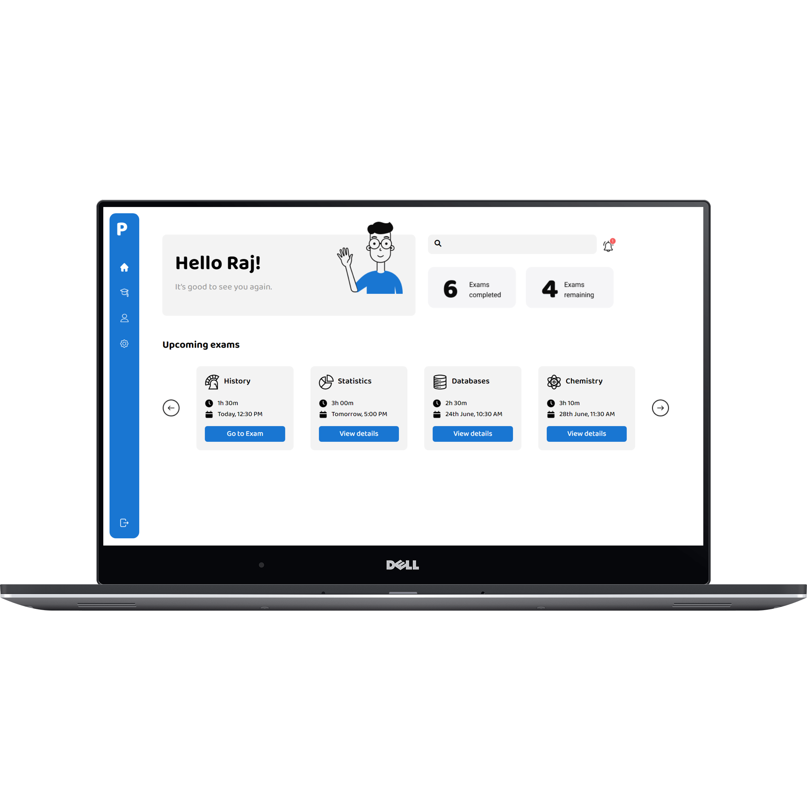
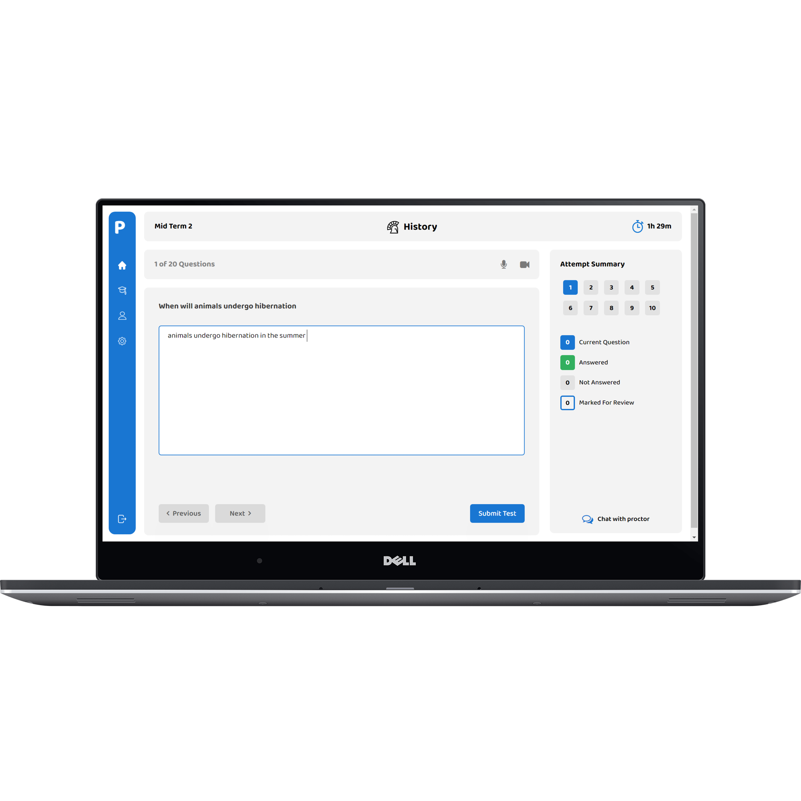
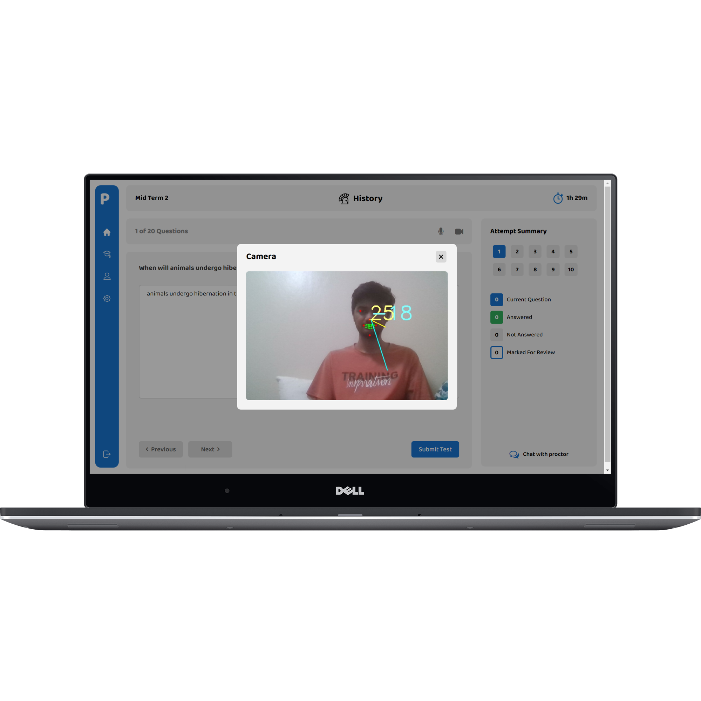
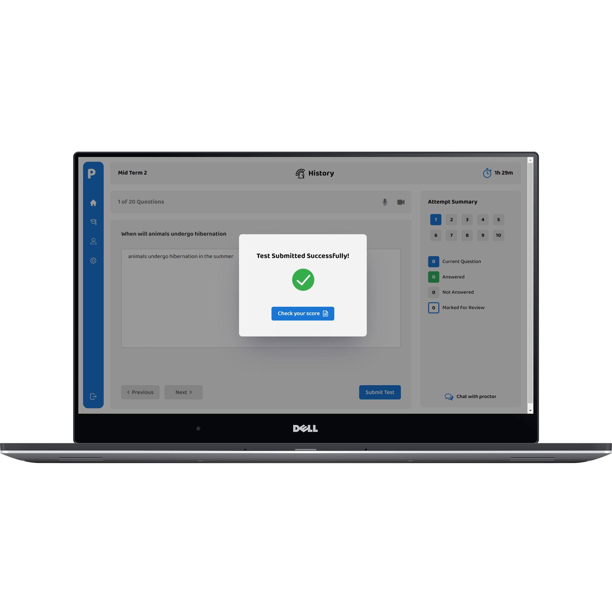
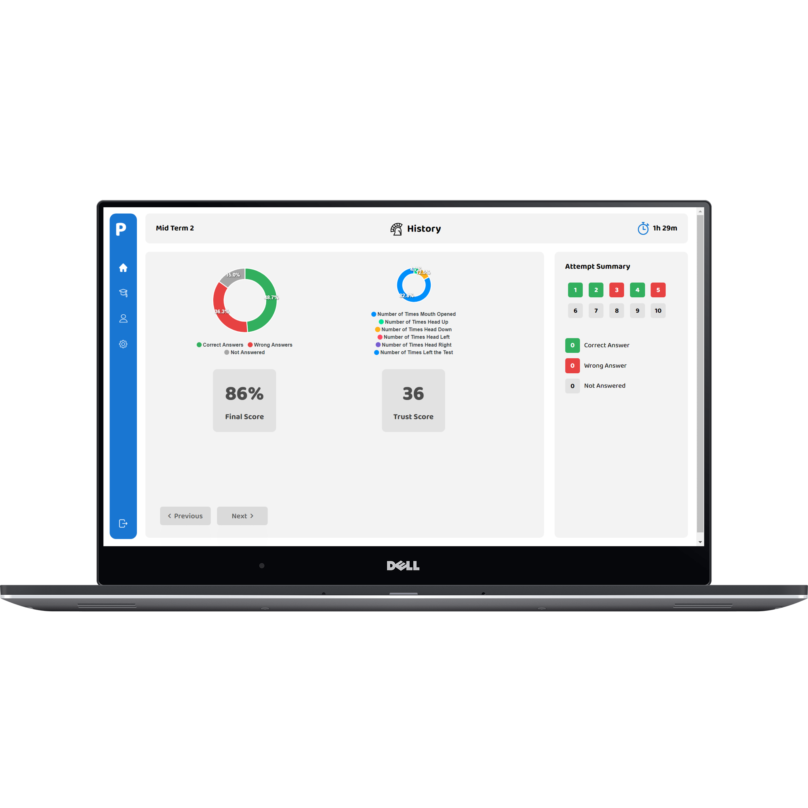
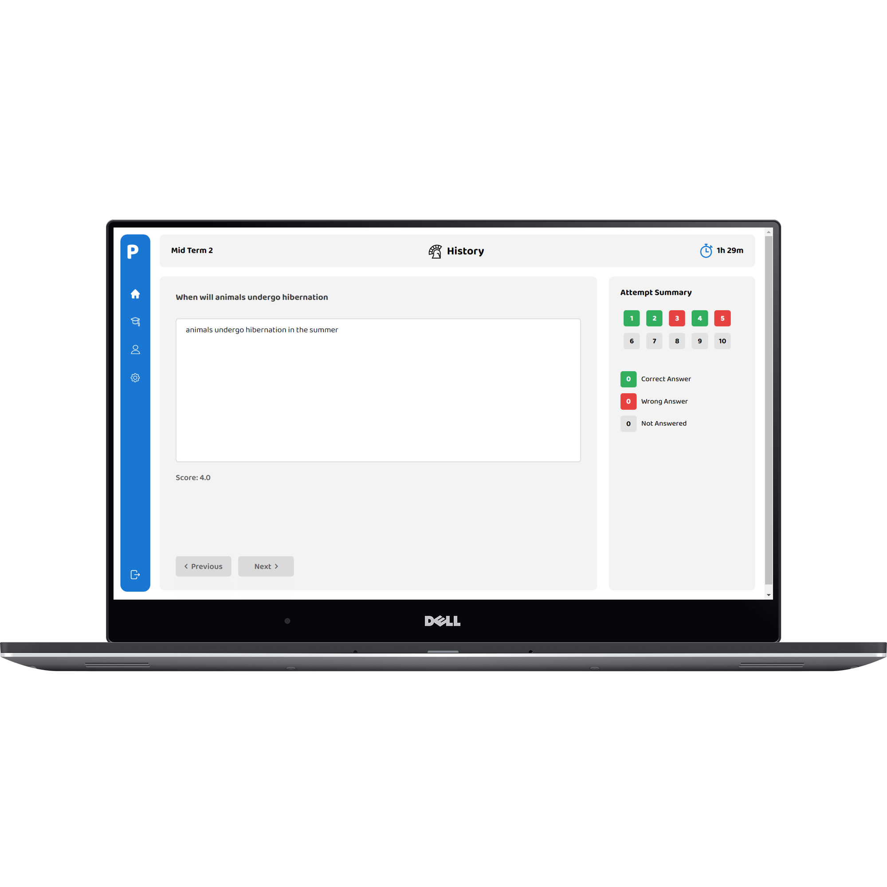
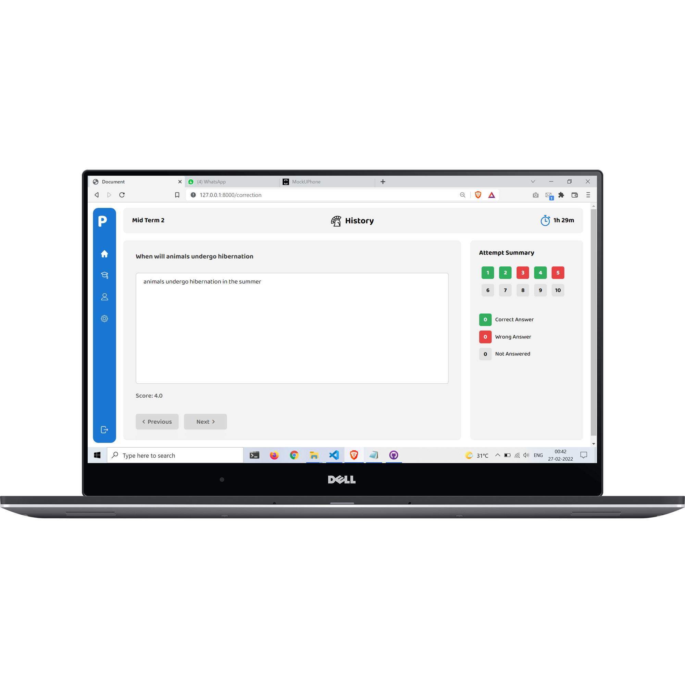

<b>A ecosystem where test takers can remotely write their exam through our webapp with the ability to evaluate the answer scripts using the NLP techniques</b>

# Project Demo

####                                Click on the image above to watch the demo

# Instructions to run application:

      1. Create a python 3.7 virtual environment and proceeed with installation there:
      
      2. Clone this repository cd to folder and install the modules in requirements.txt and run
           pip install -r requirements.txt.

      3. To run this project, Open command prompt type 

      4. cd Psedo
 
      5. Type python manage.py migrate and then python manage.py runserver
      
      6. You Can See The Website Live in  http://127.0.0.1:8000/
      
      7. Create a new account at the sign up page and avail the services.
         
# Motivation for the project:

As a result of the Coronavirus pandemic, many of us are working or learning at home. This is true for school students as well as college students.  Almost all the universities in India and abroad assess students through online tests and there are various ways in which students can cheat these tests. In order to ensure quality and integrity in the present scenario, efficient online testing is essential.By considering various parameters, we propose a system for monitoring the attentiveness of candidates, using an artificial intelligence model. The proposed scheme tracks head movements in two directions (left, right, up, and down), including mouth movements, which can be converted into a trust score based on predefined threshold values selected by the authority who conducts the assessment.   The proposed scheme can be evaluated experimentally on video samples recorded for this purpose. The thresholds for the two parameters can be adjusted independently, avoiding false results.

# Tech stack and Modules used: 
            Django , HTML5 , CSS , JavaScript ,TensorFlow OpenCV

# Implementing AI based monitoring processes:

Modules and libraries used: Tensorflow 2.0, OpenCV, Dlib(deeplibrary)
The AI-model problem can be broken down into 2 categories, Mouth movement tracking, Head movement tracking. The solution and implementation of the above on a live video feed from a webcam is explained below.

# Mouth movement tracking:

Mouth movement tracking is done in a similar manner to eye tracking here also we use Dlib facial key points. When sitting facing the webcam the distance between the lips key points is calculated and averaged for 100 frames, if the candidate opens his/her mouth the distance increases and if it increases more than a threshold value (which can be adjusted), then a warning is sent through the python app for talking during the assessment.

# Head movement tracking:

This can be done by keeping track of certain landmark points on 3D space and the angle of movement is calculated with respect to the center point, in two axis (left, right, up and down),if the angle is greater than a given threshold value (which can be adjusted), then a warning is sent through the Python app indicating to concentrate on the screen and avoid looking away from the assessment.

 # Overview of Website:

